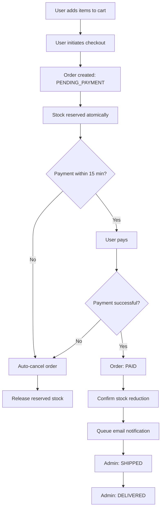

# Advanced E-Commerce API

A production-ready microservice backend for e-commerce with complex state management, transactional integrity, and asynchronous processing.

## 🚀 Features

- **JWT Authentication** with role-based access control (User/Admin)
- **Complex Order State Management** (PENDING_PAYMENT → PAID → SHIPPED → DELIVERED)
- **Inventory Reservation System** preventing race conditions
- **Database Transactions** for atomic operations
- **Automatic Order Expiration** (15-minute payment window)
- **Mock Payment Processing** with success/failure simulation
- **Asynchronous Email Notifications** (queued background jobs)
- **Pagination, Filtering & Sorting** on all list endpoints
- **Comprehensive Validation** using Joi
- **Centralized Error Handling**

## 📋 Prerequisites

- Node.js (v14 or higher)
- MongoDB (v4.4 or higher)
- npm or yarn

## 🛠️ Installation

### 1. Clone the repository

```bash
git clone <your-repo-url>
cd ecommerce-api
```

### 2. Install dependencies

```bash
npm install
```

### 3. Environment Setup

Create a `.env` file in the root directory:

```env
PORT=5000
MONGODB_URI=mongodb://localhost:27017/ecommerce
JWT_SECRET=your_super_secret_jwt_key_change_in_production
JWT_EXPIRE=7d
NODE_ENV=development
```

### 4. Start MongoDB

Make sure MongoDB is running:

```bash
# If using MongoDB locally
mongod

# Or using Docker
docker run -d -p 27017:27017 --name mongodb mongo:latest
```

### 5. Run the application

```bash
# Development mode with auto-restart
npm run dev

# Production mode
npm start
```

The server will start on `http://localhost:5000`

## 📁 Project Structure

```
ecommerce-api/
├── src/
│   ├── config/
│   │   ├── database.js          # MongoDB connection
│   │   └── constants.js         # Application constants
│   ├── models/
│   │   ├── User.js              # User model with bcrypt
│   │   ├── Product.js           # Product with stock management
│   │   ├── Cart.js              # Shopping cart
│   │   ├── Order.js             # Order with status enum
│   │   └── Payment.js           # Payment records
│   ├── middleware/
│   │   ├── auth.js              # JWT authentication
│   │   ├── errorHandler.js     # Global error handler
│   │   ├── validate.js          # Joi validation
│   │   └── roleCheck.js         # Role-based authorization
│   ├── controllers/
│   │   ├── authController.js   # Auth logic
│   │   ├── productController.js # Product CRUD
│   │   ├── cartController.js    # Cart management
│   │   ├── orderController.js   # Order processing
│   │   └── adminController.js   # Admin operations
│   ├── routes/
│   │   ├── authRoutes.js
│   │   ├── productRoutes.js
│   │   ├── cartRoutes.js
│   │   ├── orderRoutes.js
│   │   └── adminRoutes.js
│   ├── validators/
│   │   ├── authValidator.js
│   │   ├── productValidator.js
│   │   ├── cartValidator.js
│   │   └── orderValidator.js
│   ├── services/
│   │   ├── emailService.js      # Email notifications
│   │   ├── orderService.js      # Order business logic
│   │   └── stockService.js      # Stock management
│   ├── utils/
│   │   ├── jwt.js               # JWT utilities
│   │   └── responseHandler.js   # Response formatting
│   └── server.js                # Application entry point
├── .env
├── .gitignore
├── package.json
└── README.md
```

## 🔐 API Endpoints

### Authentication (`/api/auth`)

#### Register User
```http
POST /api/auth/register
Content-Type: application/json

{
  "name": "John Doe",
  "email": "john@example.com",
  "password": "password123",
  "role": "USER"  // Optional: USER or ADMIN
}
```

#### Login
```http
POST /api/auth/login
Content-Type: application/json

{
  "email": "john@example.com",
  "password": "password123"
}
```

**Response:**
```json
{
  "success": true,
  "message": "Login successful",
  "data": {
    "user": {
      "id": "...",
      "name": "John Doe",
      "email": "john@example.com",
      "role": "USER"
    },
    "token": "eyJhbGciOiJIUzI1NiIsInR5cCI6IkpXVCJ9..."
  }
}
```

### Products (`/api/products`)

#### Get All Products (Public)
```http
GET /api/products?page=1&limit=10&sortBy=price&sortOrder=asc&name=laptop
```

#### Create Product (Admin Only)
```http
POST /api/products
Authorization: Bearer <admin_token>
Content-Type: application/json

{
  "name": "Laptop",
  "price": 999.99,
  "description": "High-performance laptop",
  "availableStock": 50
}
```

#### Update Product (Admin Only)
```http
PUT /api/products/:id
Authorization: Bearer <admin_token>
Content-Type: application/json

{
  "price": 899.99,
  "availableStock": 45
}
```

#### Delete Product (Admin Only)
```http
DELETE /api/products/:id
Authorization: Bearer <admin_token>
```

### Cart (`/api/cart`)

#### Get Cart (User Only)
```http
GET /api/cart
Authorization: Bearer <user_token>
```

#### Add to Cart (User Only)
```http
POST /api/cart/items
Authorization: Bearer <user_token>
Content-Type: application/json

{
  "productId": "64f7a8b9c12345678901234",
  "quantity": 2
}
```

#### Remove from Cart (User Only)
```http
DELETE /api/cart/items/:productId
Authorization: Bearer <user_token>
```

### Orders (`/api/orders`)

#### Checkout - Create Order (User Only)
```http
POST /api/orders/checkout
Authorization: Bearer <user_token>
```

**What happens:**
1. Cart items are converted to an order
2. Stock is reserved (moved from availableStock to reservedStock)
3. Order status set to PENDING_PAYMENT
4. 15-minute timer starts
5. Cart is cleared

#### Pay Order (User Only)
```http
POST /api/orders/:id/pay
Authorization: Bearer <user_token>
```

**What happens:**
1. Payment is processed (90% success rate simulation)
2. If successful:
   - Order status → PAID
   - Reserved stock is confirmed (decremented)
   - Email notification is queued
3. If failed:
   - Order status → CANCELLED
   - Reserved stock is released

#### Get User Orders (User Only)
```http
GET /api/orders?page=1&limit=10
Authorization: Bearer <user_token>
```

#### Get Order Details (User Only)
```http
GET /api/orders/:id
Authorization: Bearer <user_token>
```

### Admin (`/api/admin`)

#### Get All Orders (Admin Only)
```http
GET /api/admin/orders?page=1&limit=10&status=PAID
Authorization: Bearer <admin_token>
```

#### Update Order Status (Admin Only)
```http
PATCH /api/admin/orders/:id/status
Authorization: Bearer <admin_token>
Content-Type: application/json

{
  "status": "SHIPPED"
}
```

**Valid Status Transitions:**
- PAID → SHIPPED
- SHIPPED → DELIVERED

## 🔄 Order Workflow



## 🔒 Authentication & Authorization

All protected routes require a JWT token in the Authorization header:

```http
Authorization: Bearer <your_jwt_token>
```

**Role-Based Access:**
- **Public**: Product listing
- **USER**: Cart management, orders, payments
- **ADMIN**: Product CRUD, all orders, status updates

## 🗄️ Database Models

### User
```javascript
{
  name: String,
  email: String (unique),
  password: String (hashed),
  role: Enum ['USER', 'ADMIN']
}
```

### Product
```javascript
{
  name: String,
  price: Number,
  description: String,
  availableStock: Number,
  reservedStock: Number
}
```

### Cart
```javascript
{
  userId: ObjectId,
  items: [{
    productId: ObjectId,
    quantity: Number
  }]
}
```

### Order
```javascript
{
  userId: ObjectId,
  items: [{
    productId: ObjectId,
    quantity: Number,
    priceAtPurchase: Number
  }],
  totalAmount: Number,
  status: Enum ['PENDING_PAYMENT', 'PAID', 'SHIPPED', 'DELIVERED', 'CANCELLED'],
  expiresAt: Date
}
```

### Payment
```javascript
{
  orderId: ObjectId,
  transactionId: String,
  amount: Number,
  status: Enum ['SUCCESS', 'FAILED']
}
```

## ⚙️ Key Features Explained

### 1. Inventory Reservation

When checkout is initiated:
- Stock is **atomically** moved from `availableStock` to `reservedStock`
- Prevents overselling during concurrent orders
- Uses MongoDB transactions for atomicity

### 2. Order Expiration

Orders in `PENDING_PAYMENT` status:
- Must be paid within 15 minutes
- Automatic cancellation after timeout
- Reserved stock is released back

### 3. Transaction Handling

Multi-step operations are wrapped in transactions:
```javascript
const session = await mongoose.startSession();
session.startTransaction();
try {
  // Multiple database operations
  await session.commitTransaction();
} catch (error) {
  await session.abortTransaction();
}
```

### 4. Asynchronous Email

Email sending is queued as a background job:
- Non-blocking
- Simulated with setTimeout (replace with Bull/BullMQ in production)

## 🧪 Testing with Postman

### Quick Test Flow

1. **Register Admin**
   ```json
   POST /api/auth/register
   { "name": "Admin", "email": "admin@test.com", "password": "admin123", "role": "ADMIN" }
   ```

2. **Create Products** (use admin token)
   ```json
   POST /api/products
   { "name": "Laptop", "price": 999, "description": "Gaming laptop", "availableStock": 10 }
   ```

3. **Register User**
   ```json
   POST /api/auth/register
   { "name": "User", "email": "user@test.com", "password": "user123" }
   ```

4. **Add to Cart** (use user token)
   ```json
   POST /api/cart/items
   { "productId": "<product_id>", "quantity": 2 }
   ```

5. **Checkout**
   ```http
   POST /api/orders/checkout
   ```

6. **Pay Order**
   ```http
   POST /api/orders/<order_id>/pay
   ```

7. **Admin Updates Status**
   ```json
   PATCH /api/admin/orders/<order_id>/status
   { "status": "SHIPPED" }
   ```

## 🔍 Error Handling

All errors return consistent format:

```json
{
  "success": false,
  "message": "Error description",
  "errors": ["Detailed error 1", "Detailed error 2"]
}
```

## 📊 Response Format

Success responses:

```json
{
  "success": true,
  "message": "Operation successful",
  "data": { ... }
}
```
